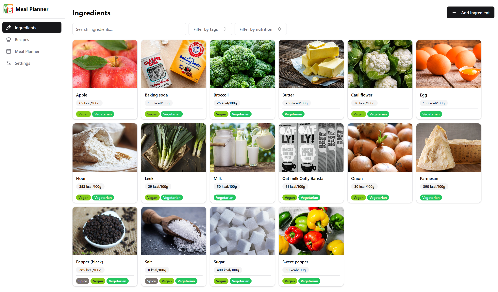
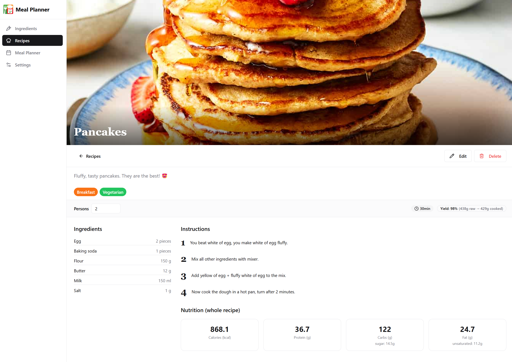
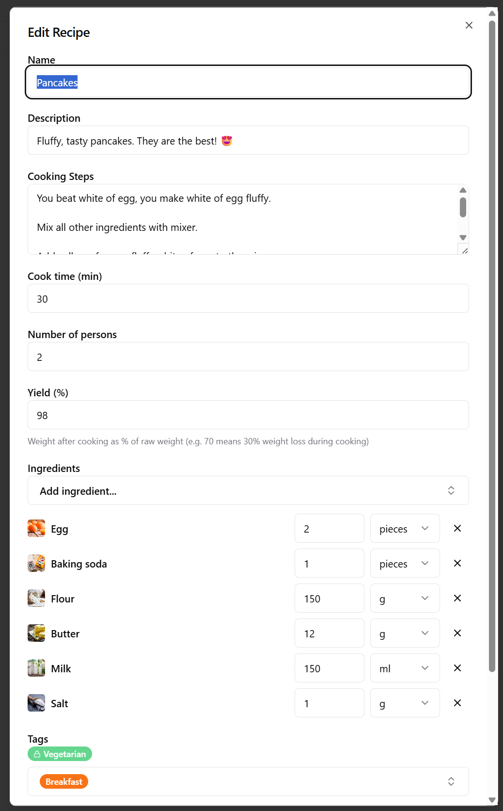
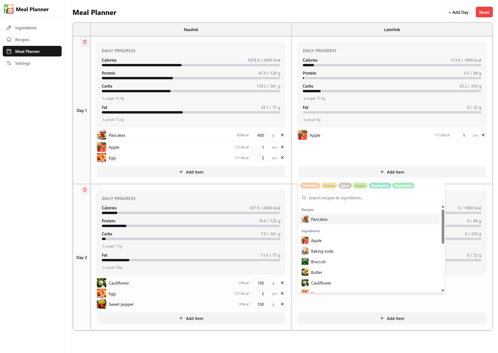
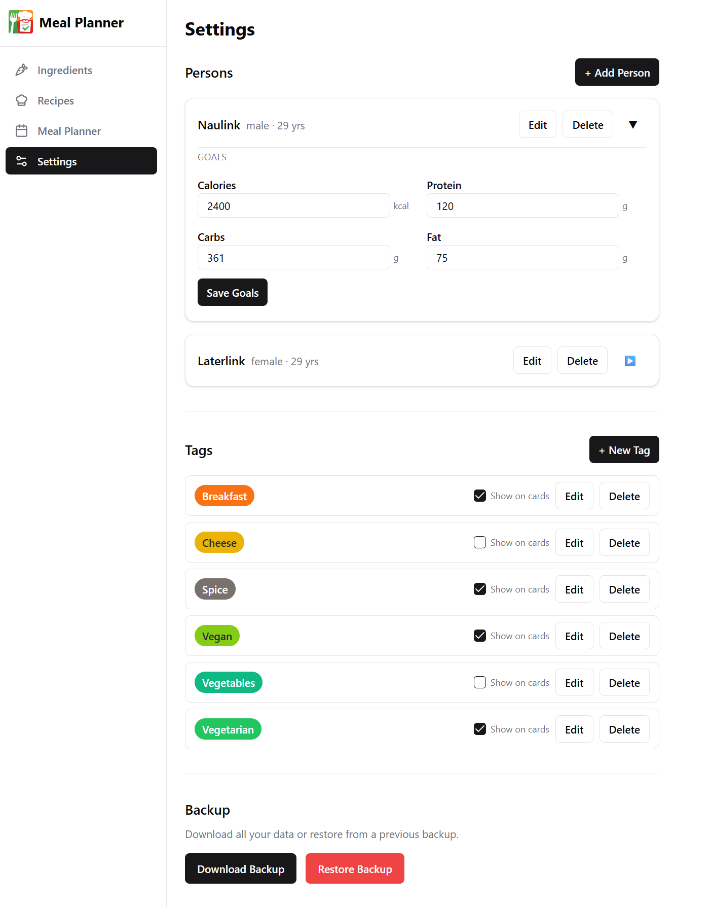

# Meal Planner

A **vibe coded** recipe tracking and meal planning tool designed to run locally in a home network.

The application allows managing ingredients, recipes and meal plans with automatic macronutrient calculations.

## Features
- Ingredients
  - CRUD with macronutrients and tags
  - Search ingredients by name, filter by tags or nutrition categories
- Recipes
  - CRUD with ingredients (and their amount), tags, cooking instructions and other infos like cook time, number of persons or yield in % (e.g. 90% if 100g of ingredients lead to 90g in the end because water evaporated)
  - Search recipes by name, filter by tags, nutrition categories or ingredients
  - View the recipe on a detail page with all the infos from above + its nutrition score
- Meal planner
  - Add, edit or remove recipes or ingredients to your days
  - View the daily nutrition score
- Settings
  - Manage persons (with their nutrition goals)
  - Mange tags
  - Backup and restore feature

## Some impressions

### Recipe detail page (the overview looks similar to the ingredient list)

## Tech Stack
- Backend: Go (REST API)
- Database: PostgreSQL
- Frontend: React + Vite
- Containers: Docker + Docker Compose
- SQL: sqlc + goose for migrations
- API documentation: Openapi with swaggo

## Requirements
- Docker
- Docker Compose

## Commands

### Use sqlc to generate go code
1. Define your sql files in backend/query
2. If you want to run sqlc for the first time: `docker pull sqlc/sqlc`
3. Run `docker run --rm -v ./backend/db:/src -w /src sqlc/sqlc generate`

### Generate Openapi docs
1. `docker run --rm -v ./backend:/code -w /code golang:1.25.5 sh -c "go install github.com/swaggo/swag/cmd/swag@latest && swag init -g cmd/server/main.go --parseDependency --parseInternal"`
2. `npx swagger2openapi ./backend/docs/swagger.yaml -o ./backend/docs/openapi.yaml`
3. `npx openapi-typescript ./backend/docs/openapi.yaml -o ./frontend/src/api/types.ts`

### Build and start everything
1. Copy .env.template to .env and fill in the values
2. Copy frontend/.env.template to frontend/.env and fill in the values
`docker compose up --build`